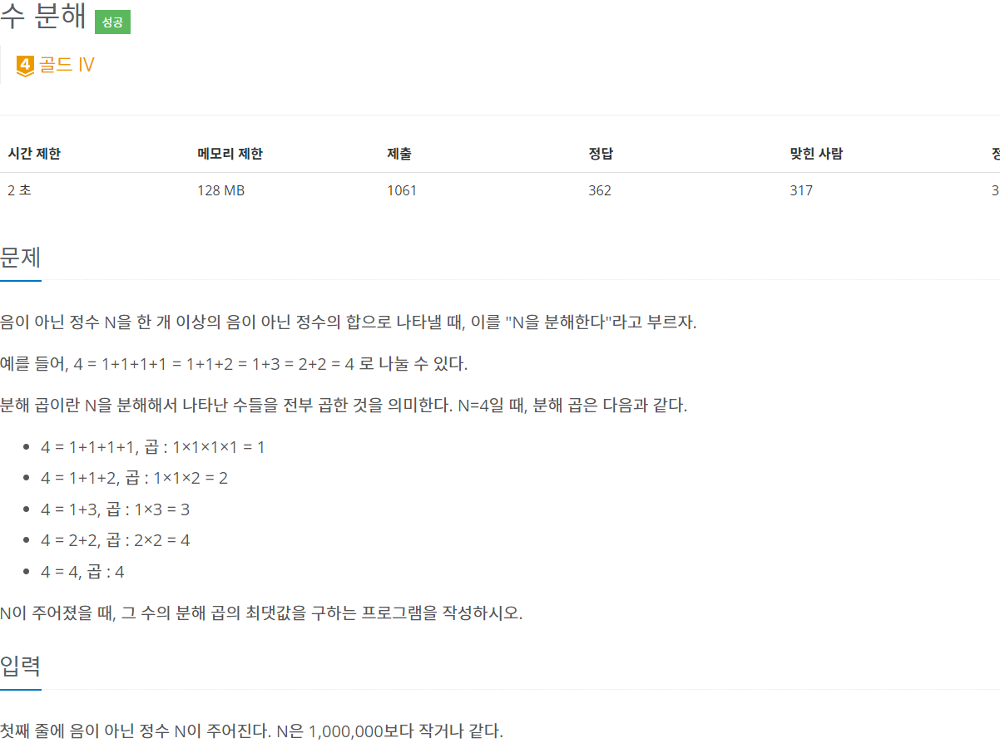
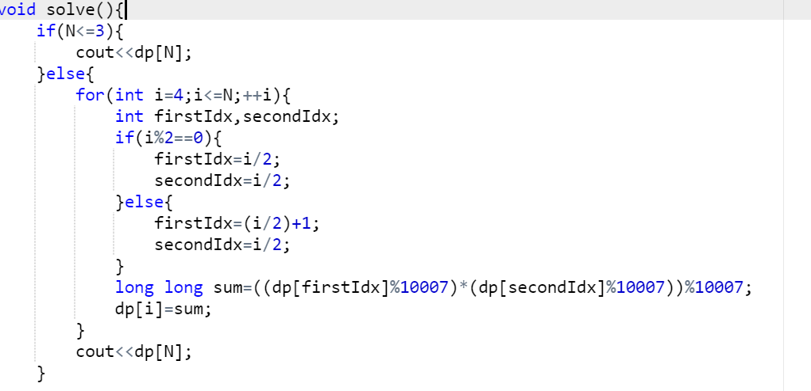

## 1437 - 수 분해

### 핵심 로직
기본 생각: 3이하 숫자의 분해합은 그 숫자 그대로이며, 0과 1을 배제한다면 결국에는 어떤 수라도 2와3을 이용한 조합이 완성될 것이다.
  
처음에 접근했던 방식: 5=3+2, 3*2=6의 케이스를 보고 N을 최대한 절반 값에 가까운 두 수의 합 조합으로 만들어 곱한다면 최적 부분 구조를 만족하는 것 처럼 보였다. 그렇기에 처음에는 dp로 접근하였다.

그런데 21의 경우를 보면,(11+10->6+5+5+5->3+3+3+2+3+2+3+2) 위와 같은 방식의 dp 접근 방식은 최종 값 조합에 2가 섞이게 되는데 21의 분해 곲은 3^7로, 접근 방식이 잘못됐음을 깨달았다. 
  
여기서 2 대신 3이 들어간 것에 혹시 무조건 3을 넣는 것이 정답이 될까? 라는 생각을 했고 실제로 N이 3의 배수인 경우
무조건 성립한다는 것을 확인했다.
 
N을 3으로 나눈 나머지가 1,2 인 경우에는 조금 달라지는데, 나머지가 1인 경우에는 최종 조합에서 3 한 개를 포기하고 최종 조합에 3이 더해진 4를 조합하는 것이 최적해이고, 2인 경우에는
3을 최대한 많이 가지고 2를 조합하는 것이 최적해이다.

### 성찰
왜 시간이 많이 걸렸는지 모르겠다. 뭔가 잘 안풀렸다. 처음 접근이 실패해서 그렇겠지만 처음 접근의 실패가 없었다면 문제의 핵심인 3을 최대한으로 가진다는 생각을 하지 못했을 것 같다.
자료구조에 숫자를 저장해야 된다는 강박도 방해가 되었던 것 같다.
N이 충분히 많이 크다면 일단 자료구조를 배제하고 생각해야겠다.