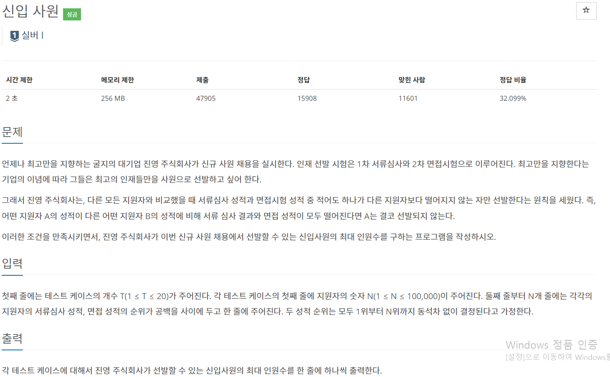

## 1946 - 신입 사원

### 핵심 로직
1. 입력에 대해 first를 기준으로 내림차순 정렬된 벡터 v를 생성한다. i를 기준으로 v를 순회한다. 
- i번째 second값보다 작은 값이 향후 i(i+1,i+2,...N-2)에 존재하면 안된다.
- first를 기준으로 내림차순 정렬했다는 것이 갖는 의미: i+1번째 사람은 i번째 사람보다 무조건 유리하다.
즉, i번째 사람은 i+1, i+2, i+3 ...번째 사람보다 유리한 조건이 있어야 한다.
  
2. 입력에 대해 second값과 해당 인덱스를 pair로 갖는 벡터 second_rank를 생성한다.
- second_rank의 first값(입력에 대한 second값)을 기준으로 오름차순 정렬한다.
- 왜 오름차순인가? 본 로직 자체가 first를 기준으로 내림차순 정렬된 v를 순회하면서 "이번 i번째 사람 뒤에 오는 사람(i+1,i+2... 번째 사람) 중 최소 second를 가진 사람"이 있는지를 체크하고, 만약 최소 second가
현재 second보다 크다면 ++cnt를 해준다. 만약 같다면 second_rank벡터를 순회하는 인덱스인 idx를 idx번째 second보다 i가 작게 될 때까지 ++idx를 해준다. 두 가지 경우를 존재한 경우의 수는 존재할 수 없다.
  
3. N-1번째 인덱스는 고려하지 않기로 한다. 무조건 1등이므로 cnt를 애초에 1로 설정하고, 벡터 v를 0에서 N-2까지만 순회한다.