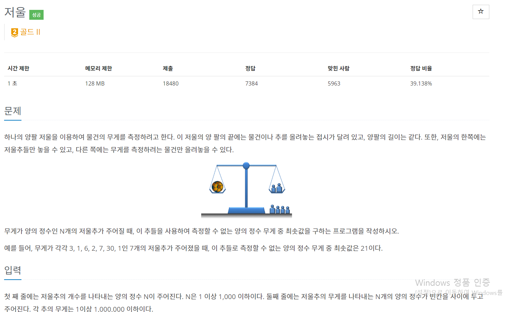

## 2437 - 저울

### 핵심 로직
초기 셋팅: sum(해당 idx까지의 모든 원소 합 +1), allowed_num(바로 인덱스 기준, 0부터 해당 값까지는 cover가 가능했음을 기억하는 변수)
v[idx]과 v[idx-1]까지의 합에 1을 더한 값(sum 변수)과 비교한다.
비교하는 이유? idx 인덱스에 진입했다는 것은 idx-1인덱스 까지 문제 없이 진행됐다는 것인데,
idx-1인덱스까지의 합 + 1은 idx인덱스에 진입하기 전에 절대로 만들 수 없는 최소 숫자이기 때문이다.
  
(1) 만약 sum에서 v[idx]를 뺀 값이 allowed_num보다 작고, 또한 0보다 크다면 allowed_num에
v[idx]를 더해준다. 더해주는 이유로는 원래도 0~allowed_num 까지의 모든 숫자를 만들 수 있는 상태였는데,
0+v[idx],1+v[idx]...allowed_num+v[idx] 까지도 추가로 만들 수 있기 때문이며, allowed_num+1에서
allowed_num+v[idx]는 새로 추가된 값이므로 cover할 수 있는 최댓값인 allowd_num+v[idx]로 초기화 시켜준다.
최종 결과인 res값도 sum+1로 초기화 시켜준다.
  
(2) 하지만 만약 1조건을 만족하지 않는 경우를 풀어서 설명해보면, sum에서 v[idx]를 뺀 값이 allowed_num보다 크거나(cover 불가능) 0보다 작게 된다면 더 이상 다음 인덱스로 갈 수 없다. 현재 인덱스에서 최솟값이 결정된다.
만약 sum+1이 v[idx]와 같다면, res는 v[idx]+1이고, 그렇지 않다면 res는 sum+1이다.