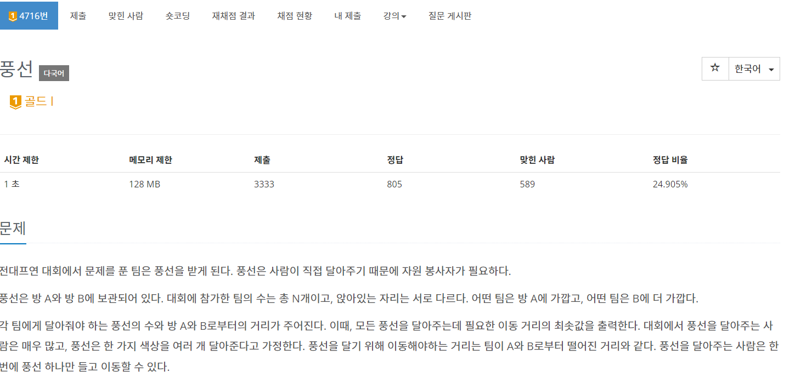

## 4716 - 풍선

### 핵심 로직
A와 B를 선택할 때 마다 기회비용이 발생한다.
가장 ideal한 방법은 기회비용을 최소로 만드는 것인데, 이를 위해서 A와 B 사이의 거리 차이가 큰 순으로 내림차순 정렬하여 greedy하게 처리한다.
  
처음에 접근했던 방식: A에 대한 거리를 기준으로 내림차순 정렬했을 때의 최솟값, B에 대한 거리를 기준으로 내림차순 정렬했을 때의 최솟값을 비교하여 더 min값을 구하는 방식을 생각했다.
  
대부분의 케이스에서 작동하나, A에 대한 거리와 B에 대한 거리가 같은 경우에 문제가 발생했고, 다른 방법을 모색했다. 두 거리가 같은 경우 문제가 발생하였기에, 거리 차이를 기준으로 정렬하는 방법을 생각했다.
  
실제로 기회비용이 큰 경우들에 대해 먼저 처리할 수 있어서
최적해를 찾을 수 있다.