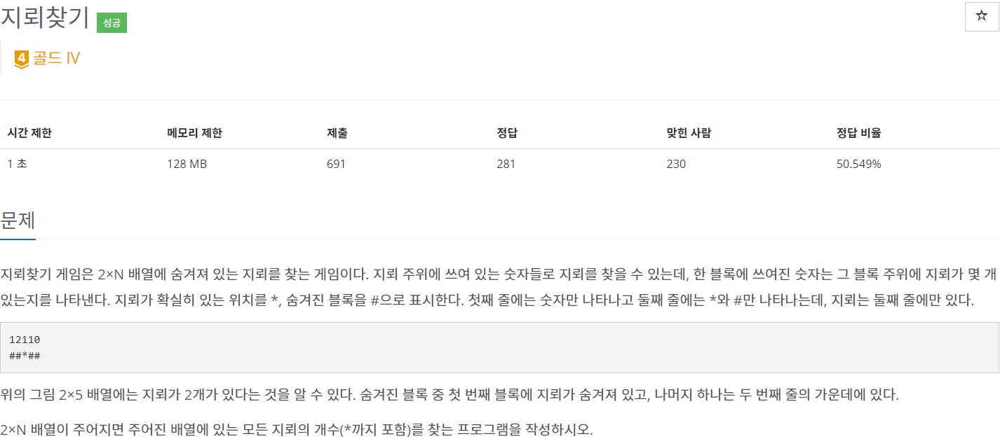

# 9082

### 핵심 로직
인덱스를 0부터 순회하면서 인근 지뢰 개수를 알려주는 숫자 배열의 바로전 인덱스, 현재 인덱스, 다음 인덱스의 값이
0보다 크면 각각의 배열 값을 1씩 빼주고 전체 지뢰 개수를 ++ 해준다.

### 회고
핵심 로직 자체는 매우 단순하지만 시간이 상당히 오래 걸렸다.
처음 접근은 숫자 배열을 기반으로 지뢰 문자열 자체를 재생성 하는 방법을 생각했는데,
지뢰 배열이 {111,###}과 {12110,##*##}일 경우 첫 번째는 가운데 위치에, 두 번째는 첫 번째 위치에 지뢰가
와야 된다. 하지만 그리디한 방식으로는 이 로직을 도저히 구현하지 못하겠어서 다른 방법으로 접근했다.
지뢰의 수만을 근거로 모든 지뢰의 최대 개수를 찾는 방식을 생각했는데 AC를 받았다.
풀었지만 무언가 찝찝하다.
